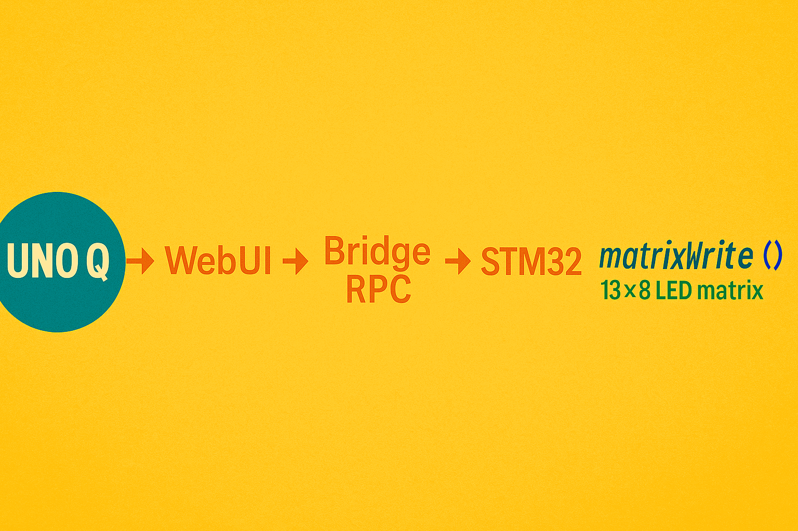
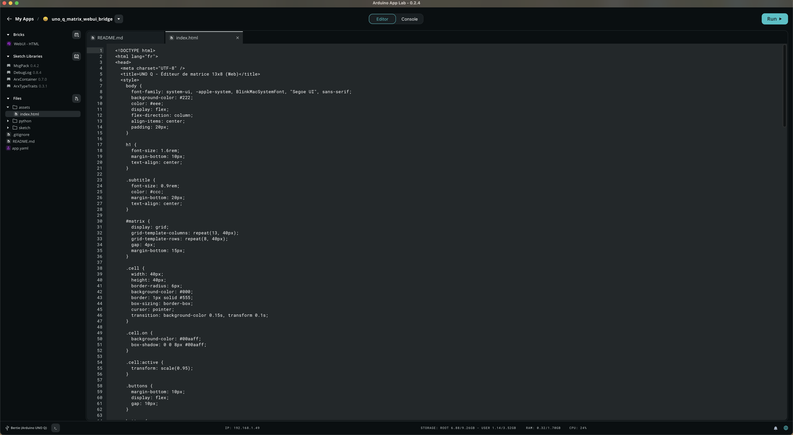
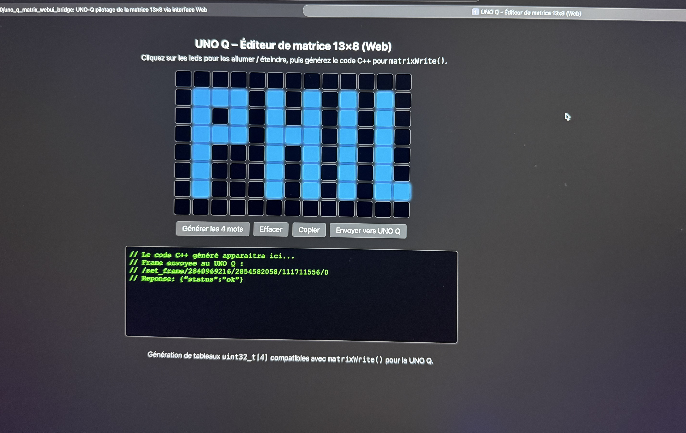
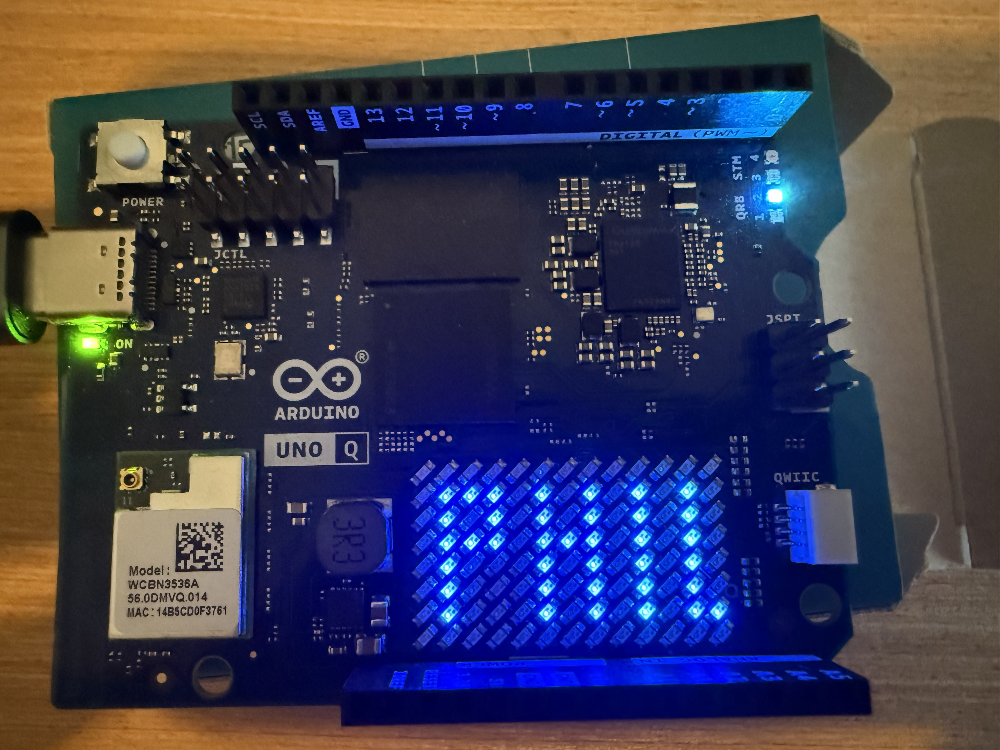

# UNO Q – WebUI → Python → Bridge → STM32 → MatrixWrite  




# 🧩 Fonctionnement 100 % dans Arduino App Lab
Ce projet fonctionne entièrement à l’intérieur d’Arduino App Lab, sans logiciel externe ni serveur  
supplémentaire.
- Le brick `WebUI – HTML` affiche l’interface 13×8 dans le navigateur.
- Le fichier Python (main.py) intercepte les appels envoyés par l’interface Web.
- Python utilise Bridge RPC pour transmettre les données au STM32.
- Le STM32 affiche le motif via la fonction interne `matrixWrite()`.
  
Ainsi, la chaîne complète reste locale à la UNO Q :

WebUI (HTML/JS)  
→ Python (App Lab)  
→ Bridge RPC  
→ STM32 Firmware  
→ matrixWrite()  

Grâce à cette interface Web locale, vous pouvez cliquer sur une matrice 13×8 et contrôler en temps réel l’affichage matériel de la UNO Q.

---

## 🎯 Objectifs du projet

- Créer une interface Web permettant de cliquer sur les 104 LED de la matrice.
- Convertir cet état en 4 mots `uint32_t`.
- Transmettre ces valeurs au cœur Linux (Qualcomm QRB2210).
- Envoyer ces valeurs vers le STM32 U585 via Bridge RPC.
- Afficher les LEDs à l’aide de `matrixWrite()`.

Ce projet constitue une démonstration claire de l’architecture **Linux ↔ Microcontrôleur** de la UNO Q.

---

# 🧩 Architecture de communication

```
              ┌───────────────────────────┐
              │     WebUI (HTML / JS)     │
              │  Interface matrice 13×8   │
              └─────────────┬─────────────┘
                            │  fetch("/set_frame/...")
                            ▼
              ┌───────────────────────────┐
              │     Python (App Lab)      │
              │ WebUI API + Bridge.call() │
              └─────────────┬─────────────┘
                            │  RPC MsgPack
                            ▼
              ┌───────────────────────────┐
              │      STM32 Firmware       │
              │ Bridge.provide + matrixWrite()
              └───────────────────────────┘
```

---

# 📂 Arborescence du dépôt

```
/
├── README.md
│
├── webui/
│   └── index.html      → Interface 13×8 en JavaScript
│
├── python/
│   └── main.py         → WebUI API + Bridge RPC
│
└── mcu/
    └── sketch.ino      → Réception des frames + matrixWrite()
```

---
# 🚀 Getting Started (pas-à-pas)

### 1️⃣ Créer une nouvelle application App Lab  
Dans l’application Arduino, cliquer sur :  

👉 **Create new app +**  

### 2️⃣ Ajouter uniquement le brick WebUI – HTML  

C’est le seul brick nécessaire pour l’interface Web. 

### 3️⃣ Ajouter le fichier `index.html` dans le dossier `assets/`  

App Lab crée automatiquement :  
- `python/main.py`  
- `sketch/sketch.ino`  

👉 Le seul élément à ajouter est `assets/index.html`.  

Pour cela :  

1. Cliquer sur **l’icône située à droite du mot “Files”** (icône dossier +).
2. Choisir **Create new folder**.
3. Saisir exactement :
```text
assets/index.html
```
4. App Lab crée automatiquement :
- le dossier **assets**,
- le fichier **index.html** à l’intérieur.
  
### 4️⃣ Coller les fichiers du dépôt GitHub
- Dans `assets/index.html` → coller le contenu du fichier `webui/index.html` du dépôt GitHub  
- Dans `python/main.py` → coller le contenu du fichier `python/main.py` du dépôt  
- Dans `sketch/sketch.ino` → coller le contenu de `mcu/sketch.ino`
  
### 5️⃣ Lancer l'application
Cliquer sur **RUN**.  

App Lab va automatiquement :  

1. Servir `index.html` via WebUI  
2. Exécuter `main.py` sur le cœur Linux  
3. Compiler et transférer `sketch.ino` dans le STM32  
4. Établir la communication Bridge Linux ↔ STM32

### 6️⃣ Tester

- La WebUI apparaît  
- Cliquez sur les LEDs 13×8  
- Cliquez sur **Envoyer vers UNO Q**  
- Les LEDs de la matrice s’allument immédiatement  

---

# 🖥️ 1. Interface Web (`webui/index.html`)

L’interface Web fournit :

- une grille 13×8 interactive,
- un calculateur de mot de 32 bits (`uint32_t`),
- un bouton **“Envoyer vers UNO Q”** qui effectue un fetch vers :

```
/set_frame/{w0}/{w1}/{w2}/{w3}
```

Chaque LED correspond à un bit dans les 4 mots de 32 bits.

Les 104 LED sont indexées :

```
index = y * 13 + x
mot  = index / 32
bit  = index % 32
```

Ce fichier génère aussi le code C++ si nécessaire.

---

# 🐍 2. Couche Python (`python/main.py`)

Le fichier Python utilise :

- **WebUI** pour exposer une API REST locale,
- **Bridge** pour transmettre les données au microcontrôleur STM32.

Fonctions principales :

```python
ui.expose_api("GET", "/set_frame/{w0}/{w1}/{w2}/{w3}", on_set_frame)

bridge.call("set_matrix_frame", v0, v1, v2, v3)
```

`main.py` agit comme un **pont** :  
**JavaScript → Python → Bridge RPC → STM32**

---

# ⚙️ 3. Firmware STM32 (`mcu/sketch.ino`)

Le STM32 expose la fonction RPC :

```cpp
Bridge.provide("set_matrix_frame", set_matrix_frame);
```

Et applique immédiatement la trame LED :

```cpp
matrixWrite(currentFrame);
```

Le tout se fait sans délai perceptible.

---

# 🧪 Exemples de trames envoyées

LED en (0,0) uniquement :

```
/set_frame/1/0/0/0
```

Petite forme allumée :

```
/set_frame/2031617/1024/0/0
```

---

# 💡 Notes importantes sur la communication interne :

• La communication entre le MPU (Linux) et le MCU (STM32) repose sur la couche Bridge,  
  qui met en œuvre un mécanisme de type RPC interne.

• Les données échangées sont sérialisées en MessagePack.

• Le transport matériel exact (UART interne ou autre bus) n’est pas exposé :  
  la couche Bridge abstrait complètement cette liaison.

• L’utilisateur n’a aucun paramétrage à faire :  
  App Lab installe automatiquement les canaux et initialise Bridge.

• Ce projet illustre l’utilisation coordonnée de :  
  – une interface Web locale (WebUI – HTML),   
  – une API REST interne (App Lab),  
  – un traitement Python,  
  – la couche Bridge RPC,  
  – le firmware STM32 et la fonction matrixWrite().


---

# 📄 Licence

Vous pouvez utiliser :

- MIT (recommandé)
- Apache 2.0
- GPLv3

Ajoutez simplement un fichier `LICENSE` si nécessaire.

---

# 🙌 Auteurs

- **Philippe86220** – conception WebUI, intégration Bridge, firmware STM32  
- **ChatGPT** – collaboration technique, documentation et chaîne de communication UNO Q  

---

# 🔗 Aperçus

# Captures d'écran :






---

# Résultat :




